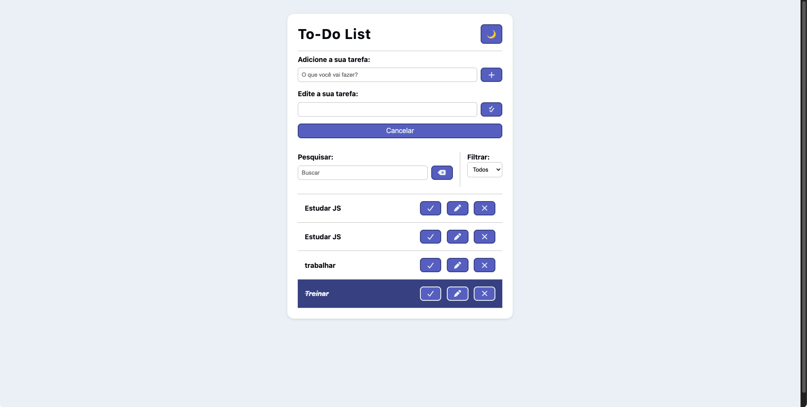

# 📝 ToDo List

Uma aplicação de lista de tarefas desenvolvida com **HTML, CSS e JavaScript**, onde é possível **adicionar, editar, remover, buscar, filtrar e marcar tarefas como concluídas**.  
As tarefas ficam salvas no **LocalStorage**, garantindo que não sejam perdidas ao recarregar a página.

---

## 🚀 Funcionalidades
- ➕ Adicionar novas tarefas  
- ✅ Marcar tarefas como concluídas  
- 📝 Editar tarefas já criadas  
- ❌ Remover tarefas  
- 🔍 Buscar tarefas pelo texto  
- 🎚️ Filtrar entre **todas**, **feitas** e **a fazer**  
- 🌙 **Dark Mode** com alternância e salvamento da preferência  
- 💾 Persistência de dados com **LocalStorage**  
- 📱 Layout **responsivo** para desktop e mobile  
- ✨ Feedback visual com **animações de hover e clique**

---

## 🛠️ Tecnologias utilizadas
- **HTML5** → estrutura do app  
- **CSS3** → estilização, responsividade e animações  
- **JavaScript (ES6+)** → manipulação do DOM, eventos e LocalStorage  
- **Font Awesome** → ícones dos botões  

---

## 📂 Estrutura de pastas

ToDo-List/
│── css/
│ └── style.css
│── js/
│ └── main.js
│── index.html


---

## ⚙️ Como executar
1. Clone o repositório:
   ```bash
   git clone https://github.com/NetoYuko/To-Do-List.git

2. Acesse a pasta:

cd ToDo-Avancado

3. Abra o arquivo index.html em seu navegador.

## 🌐 Deploy

👉 Acesse o projeto online aqui: [GitHub Pages](https://netoyuko.github.io/To-Do-List/)

## 📸 Preview



## 📌 Próximos passos

- [ ] Criar IDs únicos para cada tarefa (evitar duplicadas no LocalStorage)
- [ ] Adicionar campo de prazo e mostrar data de criação
- [ ] Implementar ordenação (recentes, antigos, concluídos)
- [ ] Categorizar tarefas por tags (ex: trabalho, estudo, pessoal)
- [ ] Exportar e importar lista de tarefas em JSON
- [ ] Adicionar animações de entrada/saída de tarefas

## 🥷🏻 Autor 

Feito por **Neto**

👉 [LinkedIn](https://www.linkedin.com/in/neto-menezes/)
